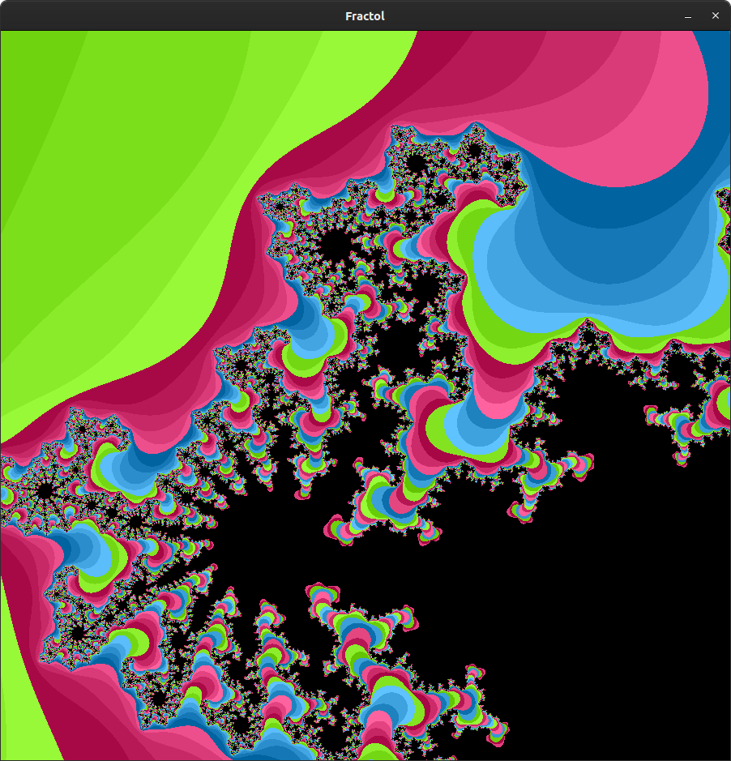
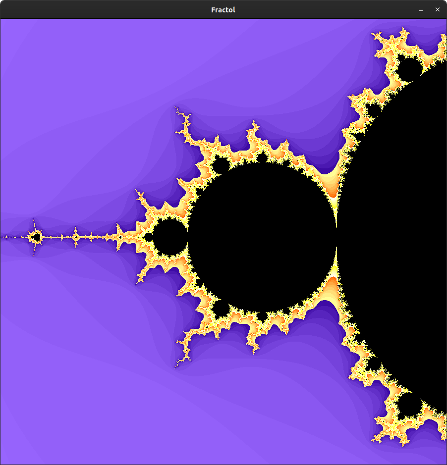
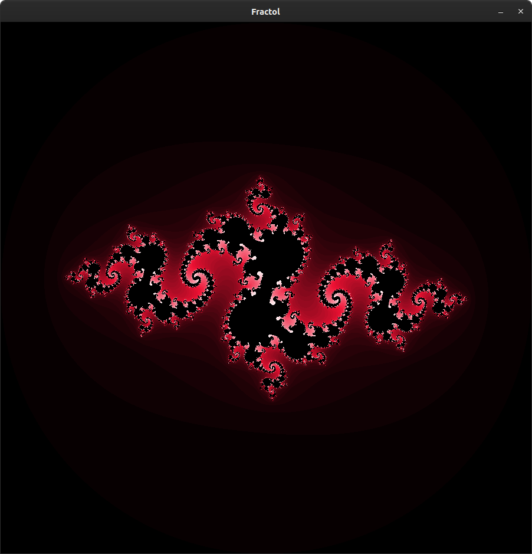

<h1 align="center">1337🇲🇦_Fractol_42 🖥🇬🇧 Kaneki</h1>
<p align="center">
  <a href="https://github.com/KanekiEzz/1337_Fractol_42">
    
  </a>
</p>


---

## 📜 About Project

> One of the first graphical projects at 42 School, fract-ol generates beautiful fractals from the complex numbers of \
> an iterative mathematical construct. A fractal is a fragmented geometrical figure that infinitely repeats itself at \
> smaller scales. This project uses the school's graphical library, MiniLibX.


## 📑 Fractals List

The program supports these fractal sets:

| Name              | Formula                                                                                            |
|:-----------------:|:--------------------------------------------------------------------------------------------------:|
| Mandelbrot        | $z_{n+1} = z_n^2 + c, z_0 = 0$                                                                     |
| Julia             | $z_{n+1} = z_n^2 + c, z_0 = c$                                                                     |
| Burning Ship      | $z_{n+1} = abs(z_n^2) + c, z_0 = 0$                                                                |
| Tricorn           | $z_{n+1} = \frac{}{z_n}^2 + c, z_0 = 0$                                                            |
| Mandelbox         | It's more complex, see [this article](https://sites.google.com/site/mandelbox/what-is-a-mandelbox) |
| Celtic Mandelbar  | $z_{n+1} = \frac{}{z_n}^2 + c, z_0 = c$                                                            |

## 🎮 Controls

The program supports the following controls:

| Key           | Description                             |
|:-------------:|:---------------------------------------:|
| ESC           | Close the program window                |
| Keys [(+)-(-)]    | Change the iteration of fractal     |
| Mouse Scroll  | Zoom in and out of the fractal          |
| ⬆️ ⬇️ ⬅️ ➡️       | Change the viewpoint                    |


## 👨‍💻 Usage
### Requirements

The program is written in C language and thus needs the **gcc compiler** and some standard **C libraries** to run.

### Instructions

**1. Compiling the program**

To compile the program, run:

```shell
$ cd path/to/fractol && make or make bonus
$ make print_usage
```

**2. How to run the program**

Run the executable too see the help message:
```shell
./fractol
```

Or run with some supported fractal:
```shell
./fractol mandelbrot
```

# 🌄 Screenshots

# vedio 

<video width="640" height="360" controls>
  <source src="public/vedio/hi.webm" type="video/webm">
  Your browser does not support the video tag.
</video>

## Mandelbrot set




## Julia set




## Burning Ship set


## Tricorn set


## Mandelbox set
